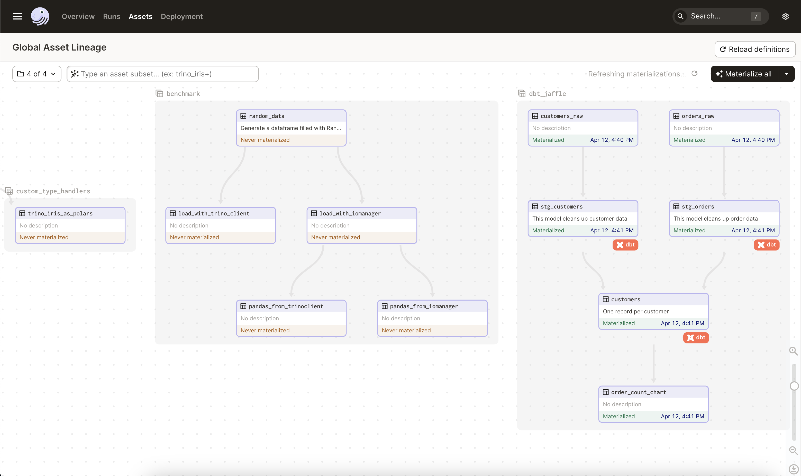

# dagster-trino 

**Transform all of your data assets into [Software Defined Assets](https://docs.dagster.io/concepts/assets/software-defined-assets)**



This repository contains an integration between Dagster and Trino that enables users to run Trino queries as part of their Dagster pipelines.

## Installation

To install the integration, clone the repository and run the following from the `dagster_trino` folder:

```shell
pip install -e .
# Have not published the library on pypi as dagster-trino yet, in case the dagster folks want to keep that name. 
```

## Configuration

To configure the integration, you'll need to provide some basic information about your Trino cluster. You can do this by creating a `trino` resource in your Dagster `Definitions` object.

```python
defs = Definitions(
    assets=[my_asset],
    resources={
        "trino": dagster_trino.resources.trino_resource.configured(
            {
                "user": trino_user, 
                "password": trino_pwd,
                "host": trino_host,
                "port": trino_port,
                "http_scheme": "https",
                "connector": "sqlalchemy"
            }
        )
    },
)
```

## Usage

Once you've configured your `trino` resource, you can use it to run queries as part of your Dagster pipelines. Here's an example:

```python
@asset(required_resource_keys={"trino"})
def my_asset():
    '''
    Simple Asset obtained from running a Trino Query explicitly.
    '''
    query = "SELECT * FROM my_table"
    return context.resources.trino.execute_query(
        sql=query,
        fetch_results=True,
        return_pandas=True
    )
```
In this example, we define an asset that runs a Trino query and returns the results as a pandas DataFrame.

## Trino IOManager

In most cases, rather than explicitly running a Trino Query using the `trino` resource, you would likely want to use a `TrinoIOManager` to create and modify Trino 
tables as dagster assets, as well as efficiently converting such tables to popular in-memory formats such as Arrow or Pandas. 

The `IOManager` is created calling the `build_trino_io_manager` function, and is configured similarly to the `trino` resource:

```python
from dagster import asset, Definitions
import dagster_trino
from dagster_trino.type_handlers import TrinoQueryTypeHandler

trino_io_manager = dagster_trino.io_manager.build_trino_iomanager([TrinoQueryTypeHandler()])

@asset(io_manager_key="trino_io_manager")
def my_asset():
    '''
    Basic Asset using the Trino IOManager
    '''
    query = "SELECT * FROM my_table"
    return query

defs = Definitions(
    assets=[my_asset],
    resources={
        "trino_io_manager": trinoquery_io_manager.configured(
            {
                "user": {"env": "TRINO_USER"}, 
                "password": {"env": "TRINO_PWD"},
                "host": {"env": "TRINO_HOST"},
                "port": {"env": "TRINO_PORT"},
                "http_scheme": {"env": "TRINO_PROTOCOL"},
                "catalog": {"env": "TRINO_CATALOG"},
                "schema": {"env": "TRINO_SCHEMA"}
            }
        )
    }
)

```

For examples of what can be achieved using the `IOManager`, refer to the [Examples](examples/) folder
 
## Contributing

If you'd like to contribute to this integration, please fork the repository and submit a pull request. We welcome bug reports, feature requests, and other contributions.

## License

This integration is provided under the MIT License. See LICENSE for more information.