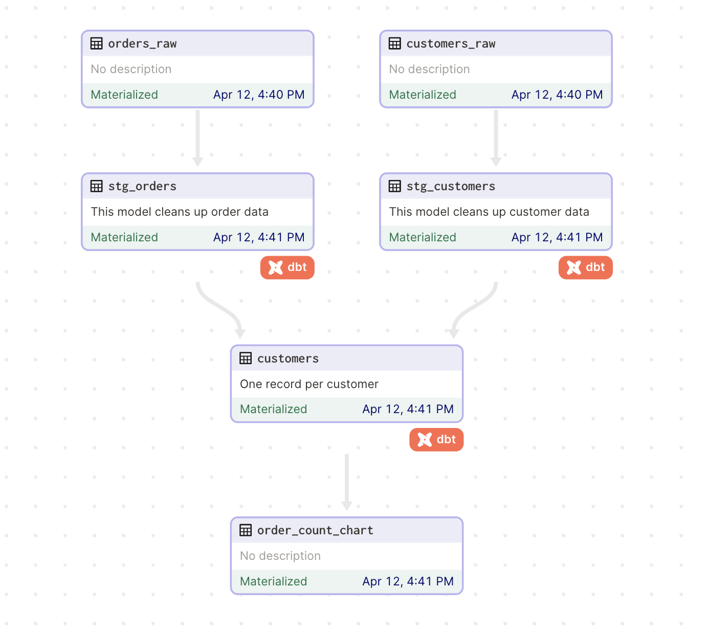

# dbt-trino with software-defined assets and Trino IOManager tutorial example



This example is a Trino adaptation of dagster's original [Using dbt with Dagster software-defined assets tutorial](https://docs.dagster.io/integrations/dbt/using-dbt-with-dagster).

The tutorial associated with this example demonstrates how to integrate dbt with Dagster using dbt's example [jaffle shop project](https://github.com/dbt-labs/jaffle_shop), the [dagster-dbt library](/\_apidocs/libraries/dagster-dbt), and the dagster-trino `ArrowPandasTypeHandler`.


## Getting started

To run this example, you need:

* A Trino Hive catalog (as `ArrowPandasTypeHandler` supports only Hive at the moment)
* A Dagster `.env` file providing the environment variables required by the dbt project `profiles.yml`:

```yml
jaffle_shop:
  target: dev
  outputs:
    dev:
      type: trino
      method: ldap 
      user: "{{ env_var('TRINO_USER') }}"
      password: "{{ env_var('TRINO_PWD') }}"
      host: "{{ env_var('TRINO_HOST') }}"
      database: "{{ env_var('TRINO_CATALOG') }}"
      schema: "{{ env_var('DBT_TRINO_SCHEMA') }}"
      port: "{{ env_var('TRINO_PORT') | as_number }}"
      threads: 1
```
