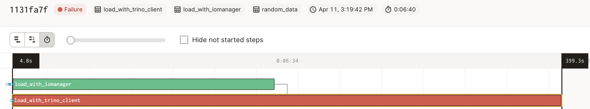
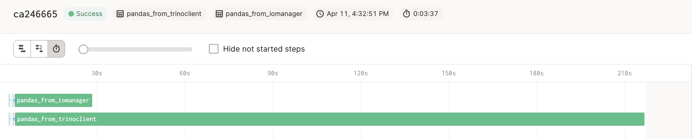

# dagster-trino Usage Examples

## Instructions

The examples contained in this folder showcase several usage patterns for dagster-trino. 

The examples can be run from the dagit UI by executing the following command from the `examples` folder:

```shell
dagit -w workspace.yaml
```

To load only selected examples, comment or remove examples that should not be loaded from the `worskpace.yaml` file. For example the following file will instruct dagit to only load examples from the `examples/0_basic_resource` folder:

```yaml
load_from:
  - python_module: 0_basic_resource
  #- python_module: 1_io_manager
  #- python_module: 2_custom_dataframe_integrations
  ```

## Examples

The modules listed in this folder showcase different ways you can leverage `dagster-trino`:

### Using a Trino Resource

The [Basic Resource](0_basic_resource/) module shows the simplest way `dagster-trino` can be used, that is, leveraging a raw `trino` resource. Using the resource, Dagster manages the Trino connection and configuration, but the user needs to explicitly get hold of the connection and execute queries against the Trino engine, for example:

```python
with context.resources.trino.get_connection() as trino_conn:
    #execute operations against Trino using the connection context manager.
```
When working with `pandas`, it is recommended to configure the `connector` property to `sqlalchemy`, in order to leverage the provided method `TrinoConnection.pandas_trino_fix` which enables Trino tables to be created from `pandas.DataFrame.to_sql()` removing the incompatible trailing semicolumns generated by pandas:

```python
df.to_sql(
    name="my_table",
    con=sqlalchemy_conn,
    method=context.resources.trino.pandas_trino_fix,
    index=False
)
```
On the other hand, reading a Trino table into a Pandas DataFrame using a `sqlalchemy` connection does not require any special fix, and can be done normally obtaining the connection as a context manager:

```python
with context.resources.trino.get_connection() as sqlalchemy_conn:
    pd.read_sql(sql=my_query, con=sqlalchemy_conn)
```

### Working with the Trino IOManager

While the Trino Resource still requires the user to explicitly interact with a Trino or SQLAlchemy connection, The IOManager is responsible for reading and writing data to and from Trino. It acts as a bridge between Trino and the user Dagster pipeline, and is responsible for ensuring that the data is properly formatted and compatible with the pipeline.

The dagster-trino IOManager has several `type_handlers` that allow the IOManager to interact with data in different formats. For example:

* `TrinoQueryTypeHandler` creates a Trino Table as a Dagster asset from a user query, or returns a query a user can execute to load an asset.
* `FilePathTypeHandler` creates a Trino Table as a Dagster asset from parquet files stored on fsspec-compatible storage (e.g. S3, GCS, HDFS), or returns the paths of parquet files backing a Trino Table on a Hive catalog.
* `ArrowTypeHandler` creates/returns Trino Table assets from/into Pyarrow Tables.

To use the IOManager, the user just needs to specify the format of the data that they want to read or write, simply by using type hints. The IOManager will then handle the conversion to and from the format specified.

### Asset I/O as Trino Queries

The [query_io_manager](1_io_manager/query_io_manager.py) example shows how to create and load Trino Table assets as Trino Queries. 

The IOManager can load pre-existing Trino Tables as Dagster assets using Dagster `SourceAsset` class. These tables can then be referenced in queries used by Software Defined Assets. 

```python
'''
Refer to existing Trino tables even though they were created 
outside of dagster pipelines
'''
my_table = SourceAsset(key="my_table", io_manager_key='trino_io_manager')

@asset(io_manager_key="trino_io_manager")
def my_table_distinct(my_table: TrinoQuery) -> TrinoQuery:
    return f'''SELECT DISTINCT * FROM {my_table}'''
```

### Loading Trino data directly from underlying storage

When dealing with large datasets, moving large amounts of data through the Trino client can be highly inefficient, as the data is serialized and transfered as JSON. This is especially the case when trying to load Trino data into a distributed system (e.g. Spark/Ray) as one Trino client connection will only send data to one node. 

In these situations, it can be several orders of magnitude faster to directly access the data from the underlying storage. The IOManager abstracts this process, letting the user focus on their business logic rather than cumbersome I/O operations. 

In particular, when writing a large dataframe into Trino using pandas `to_sql`, the Trino Client might reject the query as "too large", making accessing the underlying storage a better choice for Trino I/O. Example showing comparisons between the two methods are available in the [IOManager](1_io_manager/) folder.


*IOManager using `ArrowPandasTypeHandler` completes write succesfully, Trino Client gives up after 400 seconds*


*IOManager using `ArrowPandasTypeHandler` reads succesfully in 28s, while the Trino Client using `pandas.read_sql` takes 218s.

**Note:** right now, Hive is the only Trino Object Storage catalog where the IOManager supports direct storage access. Delta/Iceberg support is WIP, as the capability to write Delta/Iceberg data from Pyhton is still a work in progress from those respective projects. In terms of file format, Parquet-backed tables are supported, with ORC support WIP.

The [arrow_pandas_io](1_io_manager/arrow_pandas_io.py) shows how to create and load Trino Table assets by leveraging the underlying storage. First, in order to obtain a consistent interface while accessing different types of storage, [fsspec](https://filesystem-spec.readthedocs.io/en/latest/) is used. dagster-trino provides a fsspec resource that can be instantiated with a dictionary representing the parameters to pass to [fsspec.filesystem](https://filesystem-spec.readthedocs.io/en/latest/api.html#fsspec.filesystem) such as the storage protocol to use, or the authentication method to access said storage.

For example, an fsspec resource accessing Google Cloud Storage might look like this:

```python
fsspec_params = {
    "protocol": "gs",
    "token": os.environ['GCS_TOKEN'],
    "project": os.environ['GCS_PROJECT']
}
# The fsspec resource will be used by dagster-trino to directly access Trino's Hive
# catalog underlying stored parquet files.
fsspec_resource = dagster_trino.resources.build_fsspec_resource(fsspec_params)
```

The resource needs to be provided as part of Dagster `Definitions` under the `fsspec` keyword:

```python
defs = Definitions(
    assets=my_assets,
    resources={
        "trino_io_manager": trinoquery_io_manager.configured(
            {...}
        ),"fsspec": fsspec_resource.configured({
                "tmp_path": {"env": "GCS_STAGING_PATH"} #e.g. gs://my_path
            }
        )
    },
)
```

When using the Dagster Trino IOManager to access object storage, data is serialized and deserialized using Arrow, a high-performance in-memory data structure that enables efficient data processing and manipulation. This allows data to be transferred between the Dagster pipeline and Trino quickly and with minimal overhead, while at the same time abstracting all I/O operations away from the user. 

For example, the code below shows the IOManager `PandasArrowTypeHandler` creating a new `trino_iris` Table in Trino from a Pandas dataframe, by saving data as Parquet using Pyarrow on Trino's Hive underlying object storage.

```python
@asset(io_manager_key='trino_io_manager') 
def trino_iris() -> pd.DataFrame:
    return pd.read_csv(
        "https://archive.ics.uci.edu/ml/machine-learning-databases/iris/iris.data",
        names=[
            "sepal_length",
            "sepal_width",
            "petal_length",
            "petal_width",
            "species",
        ],
    )
```
Note that it is not necessary to specify a schema for the Trino table, as it will be automatically inferred from the arrow schema resulting from saving the dataframe as parquet.

### Custom Type Handlers

It is straightfoward to extend the type handlers provided, to handle other dataframe formats, providing two methods and two properties:

* `load_input`: A function describing how to load a Trino table into the desired format. 
* `handle_output`: A function describing how to create/populate a Trino table with data in the provided format. 
* `supported_types`: A list of types supported by the type handler. The type handler will be used automatically when using those types as hints in the asset definition.
* `requires_fsspec`: Whether the type handler requires direct access to the underlying Trino storage.

For example, the following code creates a type handler for [Polars](https://www.pola.rs/):

```python
class CustomPolarsTypeHandler(TrinoBaseTypeHandler):
    def __init__(self):
        self.arrow_handler = ArrowTypeHandler()

    def handle_output(self, context: OutputContext, table_slice: TableSlice, obj: pl.DataFrame, connection):
        if table_slice.partition_dimensions and len(context.asset_partition_keys) == 0:
            return pl.DataFrame()
        return self.arrow_handler.handle_output(context, table_slice, obj.to_arrow(), connection)
    
    def load_input(self, context: InputContext, table_slice: TableSlice, connection):
        return pl.from_arrow(self.arrow_handler.load_input(context, table_slice, connection))
    
    @property
    def supported_types(self):
        return [pl.DataFrame]
    
    @property
    def requires_fsspec(self):
        return True
```

Since Polars supports converting from/to arrow natively, the existing `ArrowTypeHandler` can be used to simplify the creation of the custom Polars type handler. An end-to-end example using the polars type handler can be found [here](2_custom_dataframe_integrations/polars_type_handler.py)

Similarly, custom type handlers for distributed systems such as Spark/Dask/Ray which support distributed reads of parquet files, can be made simpler by leveraging the existing `FilePathTypeHandler`.